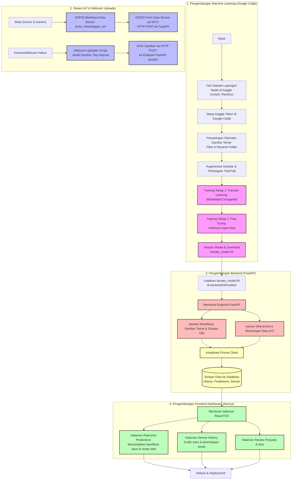

# Flowchart Tahapan Pembuatan Sistem AgriDashboard

Dokumen ini berisi diagram alir (flowchart) menggunakan sintaks **Mermaid** untuk menggambarkan seluruh tahapan pengembangan sistem AgriDashboard, mulai dari persiapan dataset, training model ML, integrasi IoT (ESP32), hingga visualisasi dashboard (Next.js & FastAPI).

---

## 1. Flowchart End-to-End Sistem

Berikut adalah visualisasi alur pembuatan sistem dari awal hingga siap digunakan:

---

## 2. Rincian Penjelasan Tiap Tahapan

### Tahap 1: Persiapan & Pelatihan Model Machine Learning (Google Colab)
*   **Pengumpulan Dataset**: Mengambil dataset *PlantDoc* dari Kaggle karena memiliki latar belakang lapangan nyata agar model tidak bias.
*   **Preprocessing (Filtering)**: Memilah folder daun tomat dan menghapus folder tanaman lain yang tidak dibutuhkan di sistem, lalu mengubah nama kelasnya agar rapi.
*   **Transfer Learning (MobileNetV2)**: Menggunakan MobileNetV2 yang sudah terlatih di ImageNet. Tahap awal hanya melatih "kepala" classifier baru.
*   **Fine-Tuning**: Membuka kunci (*unfreeze*) beberapa layer teratas MobileNetV2 dan melatih ulang dengan *learning rate* sangat kecil agar model beradaptasi penuh dengan tekstur daun tomat asli di kebun.
*   **Ekspor Model**: Menghasilkan file `tomato_model.h5`.

### Tahap 2: Pengiriman Data IoT & Kamera (ESP32)
*   **ESP32**: Membaca sensor tanah/udara lalu mengirim data tersebut secara berkala menggunakan protokol HTTP POST ke API Backend.
*   **Webcam Uploader**: Script Python di lapangan/sisi hardware yang menangkap gambar dari webcam/kamera pengawas secara real-time lalu mengirimnya ke backend untuk dianalisis otomatis.

### Tahap 3: Pemrosesan Data & Logika Bisnis (FastAPI & Prisma)
*   **TensorFlow Integration**: Backend me-load `tomato_model.h5` di dalam memori saat server menyala.
*   **FastAPI Endpoints**:
    *   Menerima data sensor IoT dan menyimpannya di DB.
    *   Menerima gambar webcam, melakukan pra-pemrosesan (resize ke 224x224), menjalankan prediksi TensorFlow, lalu mencocokkannya ke label penyakit tomat.
*   **Database (Prisma ORM)**: Menyimpan riwayat deteksi, probabilitas penyakit, dan data sensor secara aman.

### Tahap 4: Antarmuka Pengguna & Visualisasi (Next.js)
*   **Dashboard Utama**: Menampilkan grafik kondisi kebun (dari data sensor ESP32) serta rangkuman kesehatan tanaman tomat.
*   **Riwayat Prediksi**: Menampilkan daftar foto daun tomat yang ditangkap webcam beserta hasil deteksi penyakit dan akurasinya.
*   **Panduan Solusi (Review)**: Memberikan saran obat atau aksi yang harus diambil petani berdasarkan penyakit tomat yang terdeteksi.
